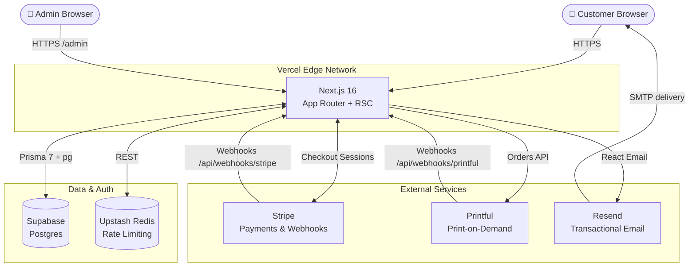

# OnlyDevs

**Premium developer merchandise — designed for engineers, shipped across Switzerland and Europe.**

---

## About

OnlyDevs is a production-deployed, full-stack e-commerce platform built for developers who want to wear their craft. The store offers print-on-demand merchandise — hoodies, t-shirts, stickers, and accessories — shipped directly from Printful's fulfillment network to customers across Switzerland and Europe.

The project was built and deployed solo as a complete commercial product. It handles the full customer lifecycle: browsing a localized storefront, multi-currency checkout via Stripe, automated order fulfillment through Printful, transactional email notifications, and post-purchase account management including GDPR-compliant data export and erasure. The admin panel provides real-time visibility into orders, customers, and revenue metrics.

Architecturally, the project leans on Next.js 16 App Router with React Server Components for server-side rendering and progressive enhancement, Prisma 7 with a native `pg` adapter against a Supabase Postgres database, and Vercel for zero-downtime edge deployments. The codebase is fully typed end-to-end, with CI enforcing type checking, linting, and unit tests on every push.

---

## Features

- **Multi-language storefront** — Five locales (EN / DE / FR / IT / PT) with per-locale routing via `next-intl`, all content translated and served from the edge
- **Multi-currency checkout** — CHF and EUR supported natively; currency resolved from shipping address with real-time switching; TWINT displayed conditionally for Swiss customers
- **Stripe payment suite** — Card, TWINT, Apple Pay, Google Pay, SEPA Direct Debit; Checkout Sessions with signed webhook verification and idempotent order processing
- **Print-on-demand fulfillment** — Full Printful API integration; order creation on payment, automatic status tracking (`PAID → SHIPPED → DELIVERED`) via inbound webhooks
- **Authentication system** — Magic-link email sign-in, credential sign-in with bcrypt, Google OAuth; all via Auth.js v5 with Prisma session adapter
- **Admin dashboard** — Protected order management, customer lookup, revenue analytics; `ADMIN` role gated at the database level with `404` fallback for unauthorized access
- **GDPR / nLPD compliance** — One-click data export (JSON download of all personal data), right-to-erasure (account anonymization with order records retained per Swiss tax law)
- **Transactional email** — React Email templates (order confirmation, shipping notification, delivery confirmation, account deletion) delivered via Resend
- **Role-based access control** — User / Admin roles enforced at the route, API, and database query layers
- **Rate limiting** — All `/api/` routes protected by Upstash Redis sliding-window rate limiter, preventing abuse on auth and checkout endpoints

---

## Architecture

**Request flow:**
1. User lands on a localized storefront route (`/en`, `/de`, etc.) — RSC renders product data from the Printful API (cached via `unstable_cache` with 1-hour revalidation)
2. Checkout creates a Stripe Checkout Session; on `checkout.session.completed` webhook, the order is persisted to Postgres and forwarded to Printful
3. Printful webhooks drive order status transitions; each transition triggers a transactional email via Resend
4. All API routes pass through Upstash Redis rate limiting before any business logic executes

---

## Tech Stack

| Technology | Version | Role | Why |
|---|---|---|---|
| **Next.js** | 16 | Full-stack framework | App Router + React Server Components eliminate client/server boundary friction; built-in image optimization, i18n routing hooks, and Vercel-native ISR |
| **TypeScript** | 5 | Language | Strict type checking across the entire stack; Prisma-generated types flow from the database schema into API handlers and UI components without a seam |
| **Prisma** | 7 | ORM | Type-safe query builder with zero-overhead native `pg` adapter (no Prisma Accelerate dependency); schema-driven migrations, excellent DX |
| **Supabase** | — | Postgres host | Managed Postgres with pgBouncer connection pooling, point-in-time recovery, and a SQL editor for running migrations — production-grade without the ops overhead |
| **Auth.js** | v5 | Authentication | Unified adapter for Google OAuth, magic-link (Resend), and credentials; Prisma session adapter keeps all auth state in Postgres |
| **Stripe** | 22 | Payments | Industry-standard SDK; native CHF support, TWINT payment method for Switzerland, signed webhook verification, and PCI DSS compliance out of the box |
| **Printful** | REST API | Fulfillment | Zero-inventory print-on-demand; handles production, packing, and international shipping so the business has no warehouse risk |
| **Resend** | — | Transactional email | Modern SMTP API designed for developers; React Email renders templates as HTML strings server-side, keeping templates type-safe and previewable |
| **React Email** | — | Email templates | Write email templates as React components; same design system as the storefront (dark theme, monospace, green accents) |
| **next-intl** | — | Internationalisation | Mature i18n library built specifically for Next.js App Router; type-safe translation keys, locale-aware routing, server-component support |
| **Tailwind CSS** | v4 | Styling | Utility-first CSS with JIT compilation; Tailwind v4's CSS-first config eliminates the `tailwind.config.js` boilerplate |
| **Upstash Redis** | — | Rate limiting | Serverless Redis with HTTP API — works on Vercel Edge without persistent connections; sliding-window counters on every API route |
| **Vercel** | — | Deployment | Zero-config Next.js deployments; preview deployments per branch, automatic HTTPS, and global CDN for static assets |
| **Cloudflare** | — | DNS + CDN | DDoS mitigation, proxy layer between the public internet and Vercel, and sub-millisecond DNS globally |
| **Vitest** | 4 | Unit testing | Fast, Vite-powered test runner with native TypeScript support; covers validation, currency, and shipping calculation logic |
| **GitHub Actions** | — | CI | Parallel jobs for type checking, linting, and unit tests on every push; build job validates the Next.js production build with fallback env stubs |

---

## Screenshots

> Screenshots and a live demo video are coming soon.
>
> Visit **[www.onlydevs.shop](https://www.onlydevs.shop)** to see the live store.

---

## License

© 2025 Fernando Gonçalves. All rights reserved.

This repository is made available for portfolio and educational review purposes only.

**You may NOT:**
- Use this code, in whole or in part, for commercial purposes
- Redistribute, sublicense, or sell this code or derivatives
- Deploy this code as a competing or similar service
- Remove this license notice from any copy

**You MAY:**
- View the code to evaluate the author's work
- Reference specific patterns or snippets for learning, with attribution

For licensing inquiries, contact: [onlydevs.shop@gmail.com](mailto:onlydevs.shop@gmail.com)

---

## Contact

**Fernando Gonçalves**
- Email: [onlydevs.shop@gmail.com](mailto:onlydevs.shop@gmail.com)
- Live site: [www.onlydevs.shop](https://www.onlydevs.shop)
- GitHub: [@Goncalves95](https://github.com/Goncalves95)
